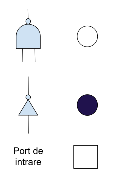

# Maparea tehnologică
În urma minimizării logice se obține o rețea de logică booleană (boolean logic network) care în continuare este o reprezentare abstractă a circuitului. Prin maparea tehnologică rețelele logice sunt tranformate într-o listă de porți dintr-o bibliotecă de celule standard a unei tehnologii țintă și interonectarea porților.
## Biblioteci de celule standard
O bibliotecă de celule standard este o coleție de porți logice (AND, OR, XOR, etc) și elemente de memorare (latch sau bistabil) având realizate layout-ul lor. Aceste structuri sunt caracterizate din punct de vedere electric (timpi de propagare, capacități parazite, consum, etc.).
Exemple:
O bibliotecă de celule standard cu sursă deschisă se găsește [aici](http://www.vlsitechnology.org/index.html).
Bibliotecile cu celule standard a diferitelor tehnologii de fabricație sunt adese ori confidențiale, astfel nu sunt publice. Se găsesc câteva biblioteci de celulă standard realizat de universități care pun la dispoziție biblioteicele. De exemplu, o bibliotecă standard pentru fabrica TSMC în tehnologia 0,25um CMOS se găsește [aici](https://vlsiarch.ecen.okstate.edu/flows/).
## Solutie
O solutie posibila pentru maparea tehnologica este oferit de un procedeu denumit acoperirea arborelor (tree covering). Un prim pas este conversia retelei logice iintr-o arbore, iar aceasta arbore este acoperit de arbori mai mici, corespunzatori unor porti incluse intr-o librarie standard.
### Reprezentarea
Orice functie booleana se poate implementa folosind doar porti inverosare si porti NAND. Astfel retelele logice boolene sunt convertite in retele de INV si NAND. Pentru o reprezentare a retelelor booleene si mai simple se foloseste urmatoarea reprezentare. O operatie de negare este notat cu o bulinuta neagra, o operate de NAND este inlocuit cu o bulinuta alba, iar un port de intrare este reprezentat de un patratel. 

