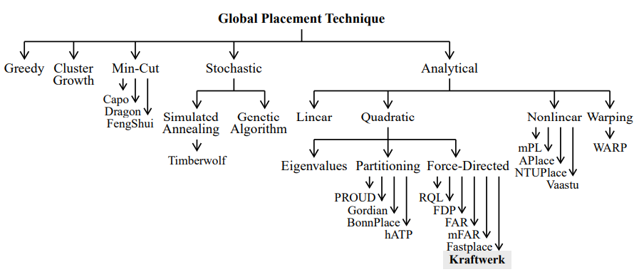

# Plasare

## Definitie
Plasarea este o etapă în fluxul de proiectare a circuitelor integrate digitale. Intrarea de procesului deplasare este circuitul obținut în urma mapării tehnologice (o listă de porți și interonexiunile porților). Plasarea constă în a determina pozițiile modulelor, în timp ce luăm în considerare diferite obiective și constrângeri. Constrângerile fundamentale sunt că porțile nu se suprapun și că toate modulele sunt amplasate în aria desemnată de footprint. O altă constrângere a plasării este, de exemplu, alinierea modulelor în rânduri sau la o structură de grilă. Principalul obiectiv al plasării este minimizarea lungimii totale a firelor, adică minimizarea sumei de lungimile tuturor plaselor. Acest obiectiv este utilizat deoarece cu o lungime minimă de fir, circuitul este ușor de parcurs, frecvența maximă a semnalului de tact este mare, iar consumul de energie este redus. 

## Problema Plasării
Problema plasării este așezarea porților astfel încât:
    •  toate obiectivele relevante (de exemplu, lungimea totală a firului) sunt optime și
    •  toate constrângerile (de exemplu, nu se suprapun) sunt îndeplinite.
    Problema de plasare este o problemă combinatorică, despre care se știe că este o problemă NP-completă. Aceasta înseamnă că nu există un algoritm la zi, care să rezolve problema optimă cu complexitate de runtime polinomială. În cazul extrem, toate plasările posibile ttrebuie inspectate, pentru a găsi plasarea optim. Cu milioane de porți, numărul de plasărilor fezabile este destul de mare, adică, timpul de rulare nu este practicabil.
Prin urmare, pentru a obține soluții bune în timpul rulării polinomiale, problema plasării este rezolvată cu metode euristice. O metodă tradițională este de a utiliza doi pași pentru plasare: plasarea globală și cea finală. În plasarea globală, modulele sunt distribuite aproximativ pe cip, cu puține suprapuneri rămas. În plasarea finală, suprapunerea este eliminată, iar modulele sunt aliniate la structură grilă / rând. 
       Plasarea globală înseamnă a răspândi modulele aproximativ pe cip, rezultând o plasare cu câteva suprapuneri. În deceniile anterioare, au fost dezvoltați algoritmi pentru plasarea globală. Ele diferă în principal în modul în care este minimizată lungimea firului și în ce mod sunt răspândite porțile pe cip. Figura de mai jos clasifică diferite tehnici și prezintă sisteme de plasare de ultimă generație. 

       
### sub-sub titlu

